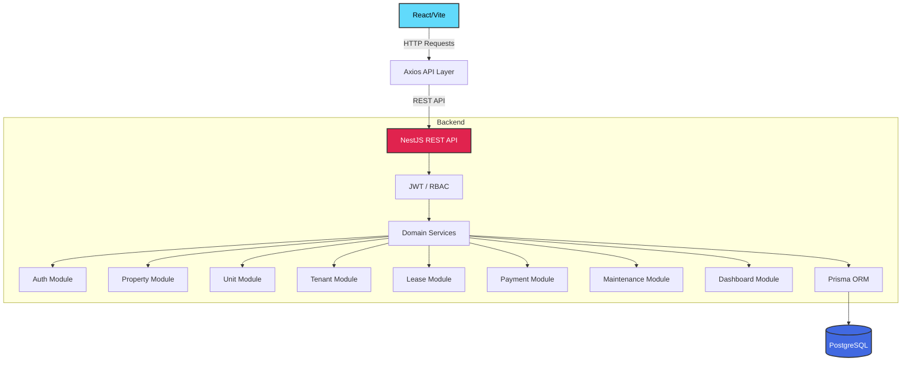

# Nestly

Multi-tenant property management SaaS for property owners and tenants.


## Project Overview

Nestly is a multi-tenant SaaS application designed to streamline property management for landlords and property owners while offering a clear and transparent portal for tenants.

The problem it solves: Managing properties, leases, maintenance, and payments across multiple units and tenants is often handled using fragmented tools (spreadsheets, emails, cash). Nestly brings all these operations into a unified platform with strict data isolation.

### Primary Users

- **OWNER**: Landlords and property managers who need to oversee their portfolio, units, and leases.
- **TENANT**: Renters who need to view lease details, track payments, and report maintenance issues.
- **ADMIN**: Platform administrators with system-level visibility.

### Core Workflows

**OWNER**:
- Register/login
- Manage properties
- Manage units
- Create tenants
- Create/manage leases
- Record payments
- Manage maintenance requests
- View dashboard analytics

**TENANT**:
- Login
- View active lease/home
- View payments
- Report maintenance issues
- Track maintenance status

**ADMIN**:
- Platform-level visibility according to implemented backend RBAC

---

## Engineering Highlights

Nestly employs professional, production-ready engineering patterns:

- **Multi-tenant data isolation**: Strict authorization constraints ensuring Owners and Tenants only access their own data.
- **JWT authentication**: Secure stateless authentication strategy.
- **Role-Based Access Control**: Decorator-driven RBAC layer on all endpoints.
- **Ownership-based authorization**: Verification of data ownership before mutations.
- **Prisma ORM**: Type-safe database interactions with relational constraints.
- **PostgreSQL**: Robust, ACID-compliant relational data store.
- **RESTful API design**: Clear, resource-oriented endpoint architecture.
- **DTO validation**: `class-validator` securing all incoming request payloads.
- **bcrypt password hashing**: Secure credential storage.
- **Rate limiting**: `@nestjs/throttler` preventing abuse and brute-force attacks.
- **Helmet security headers**: HTTP header security.
- **CORS**: Configured cross-origin resource sharing.
- **Prisma exception handling**: Global exception filter mapping DB errors to standard HTTP responses.
- **Graceful shutdown**: Configured to cleanly disconnect from the database on termination.
- **Production environment validation**: Strict `.env` validation schema on startup.
- **Database-level aggregation**: Efficient analytics queries handled at the database level.
- **Transactional tenant creation**: Atomic creation of User and Tenant profiles.
- **Lease lifecycle management**: State transitions for leases.
- **Payment lifecycle**: Status tracking for rent payments.
- **Maintenance lifecycle**: Clear resolution steps for reported issues.
- **Frontend API abstraction**: Axios instance configured with automatic token injection.
- **Zustand authentication state**: Performant, minimal state management.
- **Responsive React UI**: Polished, Tailwind v4 and shadcn/ui powered interface.

---

## Architecture



### Ownership Boundary

**OWNER**
↓
Properties
↓
Units
↓
Leases
↓
Payments / Maintenance

**TENANT**
↓
Tenant Profile
↓
Active Lease
↓
Unit
↓
Payments / Maintenance

---

## Features

| Module | Status |
|---|---|
| Authentication | ✅ |
| RBAC | ✅ |
| Property Management | ✅ |
| Unit Management | ✅ |
| Tenant Management | ✅ |
| Lease Management | ✅ |
| Payment Management | ✅ |
| Maintenance | ✅ |
| Dashboard Analytics | ✅ |
| Notifications | Planned |
| Invoices | Planned |
| Payment Gateway | Planned |

---

## Tech Stack

### Frontend
| Technology | Description |
|---|---|
| **React 19** | UI Library |
| **Vite** | Build Tool |
| **TypeScript** | Type Safety |
| **Tailwind CSS v4** | Utility-first CSS |
| **shadcn/ui** | UI Component System |
| **Axios** | HTTP Client |
| **React Router** | Navigation |
| **Zustand** | State Management |

### Backend
| Technology | Description |
|---|---|
| **NestJS** | Node.js Framework |
| **TypeScript** | Type Safety |
| **Prisma** | ORM |
| **PostgreSQL** | Relational Database |
| **Passport & JWT** | Authentication |
| **bcrypt** | Password Hashing |
| **class-validator** | Payload Validation |
| **Helmet** | HTTP Security Headers |
| **@nestjs/throttler** | Rate Limiting |

### Testing
| Technology | Description |
|---|---|
| **Jest** | Test Runner |
| **Supertest** | HTTP Assertions |
| **E2E Tests** | End-to-End API Tests |

---

## Project Structure

```text
nestly/
├── Backend/
│   ├── prisma/             # Database schema and migrations
│   ├── src/                # NestJS application code
│   │   ├── auth/           # Authentication logic
│   │   ├── property/       # Property management
│   │   ├── unit/           # Unit management
│   │   ├── tenant/         # Tenant profiles
│   │   ├── lease/          # Lease lifecycle
│   │   ├── payment/        # Payment tracking
│   │   ├── maintenance/    # Issue reporting
│   │   ├── dashboard/      # Analytics aggregation
│   │   ├── prisma/         # Prisma service wrapper
│   │   └── common/         # Guards, decorators, filters
│   └── test/               # E2E test suites
│
├── Frontend/
│   └── src/                # React application code
│
├── docs/                   # Additional documentation
├── .env.example            # Environment variables template
├── .gitignore
├── LICENSE
└── README.md               # This file
```

---

## Local Development

### Prerequisites
- Node.js
- PostgreSQL

### Backend Setup

1. Navigate to the backend directory:
```bash
cd Backend
npm install
```

2. Configure environment variables (copy `.env.example` to `.env` and fill the values).

3. Set up the database:
```bash
npx prisma generate
npx prisma migrate dev
```

4. Start the server:
```bash
npm run start:dev
```

### Frontend Setup

1. Navigate to the frontend directory:
```bash
cd Frontend
npm install
```

2. Configure environment variables (if required).

3. Start the dev server:
```bash
npm run dev
```

### Expected URLs
- **Backend API**: http://localhost:3000
- **Backend Health Check**: http://localhost:3000/health
- **Frontend App**: http://localhost:5173

---

## Environment Variables

### Backend
- `DATABASE_URL`: Connection string for PostgreSQL.
- `JWT_SECRET`: Secret key for signing JWTs.
- `JWT_EXPIRES_IN`: Expiration time for JWTs (e.g., '1d').
- `FRONTEND_URL`: CORS allowed origin.
- `NODE_ENV`: 'development' or 'production'.
- `PORT`: Server port (default 3000).

### Frontend
- `VITE_API_BASE_URL`: URL of the backend API.

> [!WARNING]
> Never commit `.env` files or production secrets to version control.

---

## Testing

### Backend Commands
- **Build**: `npm run build`
- **Lint**: `npm run lint`
- **Unit Tests**: `npm run test`
- **E2E Tests**: `npm run test:e2e`

*Note: Currently, 67/67 backend E2E tests are passing.*

### Frontend Commands
- **Build**: `npm run build`
- **Lint**: `npm run lint`

---

## Documentation

For deeper technical details, please refer to the documents below:

- [API Documentation](docs/api.md)
- [Architecture Documentation](docs/architecture.md)
- [Database Documentation](docs/database.md)

---

## License

This project is licensed under the [MIT License](LICENSE).
