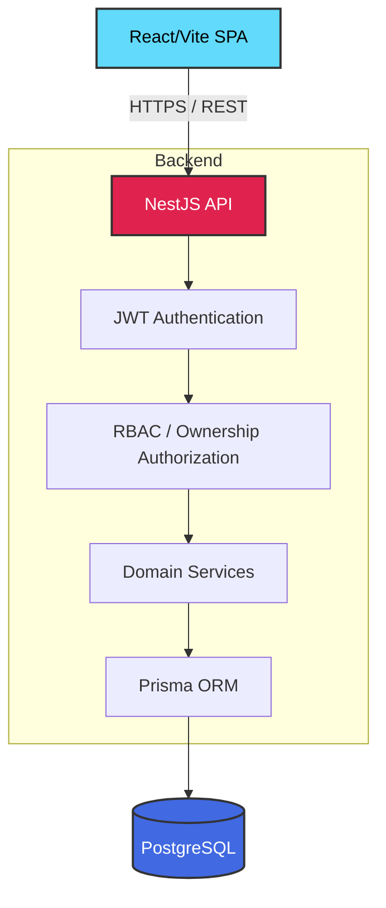
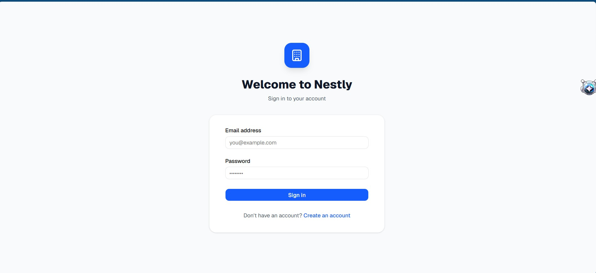
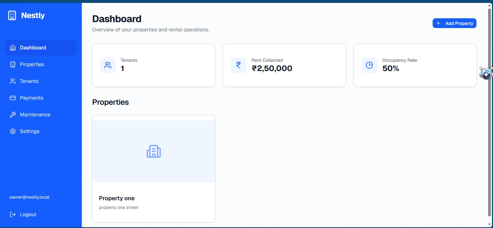
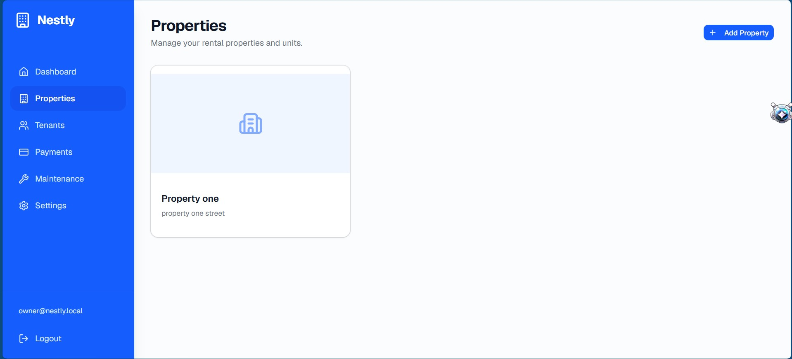
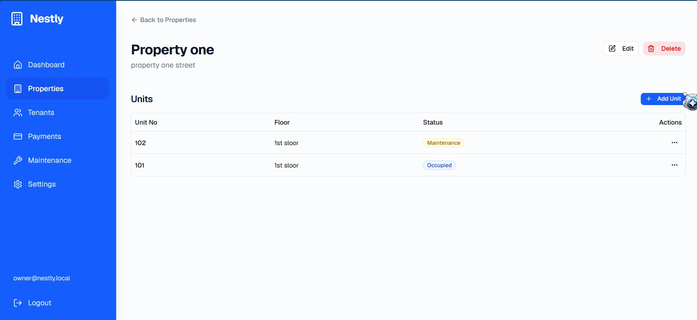
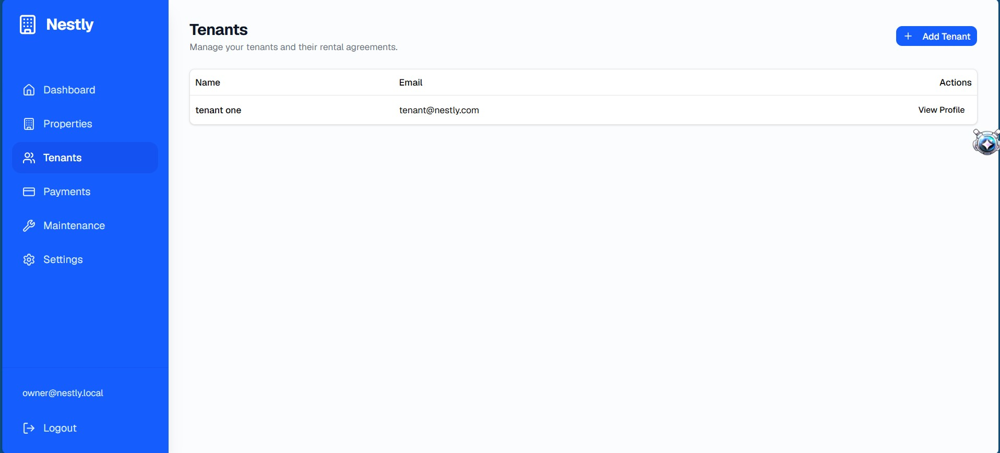
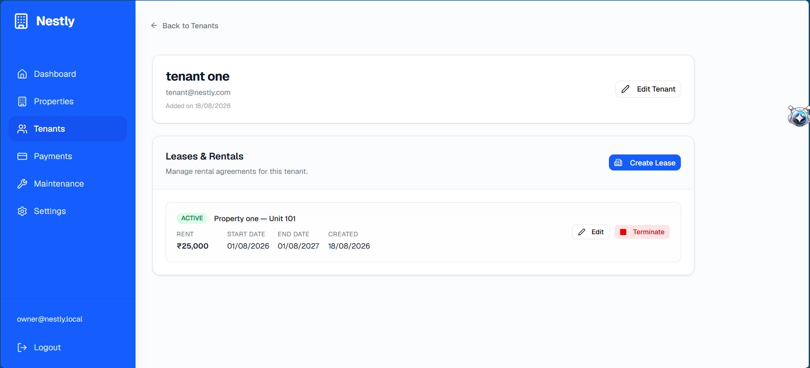
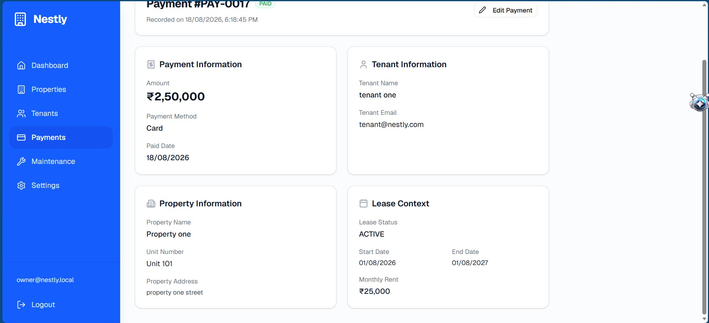
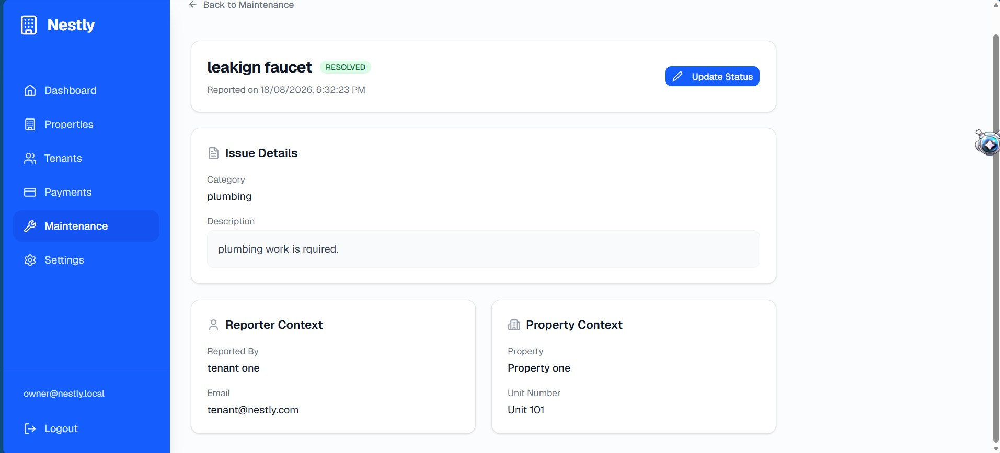

# Nestly

Multi-Tenant Property Management Platform

Nestly is a full-stack multi-tenant property management platform built with React, NestJS, PostgreSQL, and Prisma. It provides secure workflows for property owners, tenants, and administrators including property management, unit management, tenant and lease lifecycle management, payment tracking, maintenance workflows, and dashboard analytics.

---

## Engineering Highlights

- **Multi-tenant ownership isolation**: Strict database and application-level isolation ensuring users only access their own data and resources.
- **JWT authentication**: Secure stateless authentication implementation.
- **Role-Based Access Control**: Decorator-driven RBAC layer enforcing endpoint permissions.
- **Resource-level authorization**: Ownership verification before any data mutation occurs.
- **Property and unit management**: Hierarchical data modeling for property portfolios and individual units.
- **Tenant and lease lifecycle management**: State transitions for leases and tenant profile management.
- **Payment tracking**: Financial transaction tracking linked to specific leases and tenants.
- **Maintenance lifecycle management**: End-to-end issue reporting and resolution workflows.
- **Database-level dashboard aggregation**: Efficient analytics using PostgreSQL aggregate functions via Prisma.
- **DTO validation**: `class-validator` ensuring data integrity at the API boundary.
- **Global validation pipe**: Enforcing validation rules automatically, with `whitelist` and `forbidNonWhitelisted` to prevent payload injection.
- **Prisma exception handling**: Centralized filters mapping database errors (like unique constraint violations) to standardized HTTP responses.
- **Security headers with Helmet**: Automatic HTTP header security against common vulnerabilities.
- **Authentication rate limiting**: `@nestjs/throttler` guarding against brute-force attacks.
- **Request body size limits**: Configured to prevent denial-of-service through oversized payloads.
- **Graceful shutdown**: Proper database connection termination on SIGTERM/SIGINT.
- **Production environment validation**: Strict startup validation of `.env` configurations.
- **PostgreSQL relational modeling**: ACID-compliant data storage with enforced foreign key constraints.

---

## Architecture



---

## Features

| Module | Status |
|---|---|
| Authentication | Complete |
| RBAC | Complete |
| Properties | Complete |
| Units | Complete |
| Tenants | Complete |
| Leases | Complete |
| Payments | Complete |
| Maintenance | Complete |
| Dashboard Analytics | Complete |
| Notifications | Planned |
| Invoices | Planned |
| Payment Gateway Integration | Planned |

---

## Application Screenshots

### Login


### Owner Dashboard


### Properties


### Property Units


### Tenant Management


### Tenant Lease


### Payment Management


### Payment Detail
<!-- TODO: Add missing screenshot screenshots/payment-detail.png -->

### Maintenance Management


### Maintenance Detail
<!-- TODO: Add missing screenshot screenshots/maintenance-detail.png -->

---

## Security

Nestly implements multiple layers of security controls:
- **JWT authentication**: Stateless, secure token validation.
- **RBAC**: Enforces role constraints globally.
- **Ownership-level authorization**: Prevents lateral access to other tenants' data.
- **DTO validation**: Strict validation using `class-validator` with `whitelist` and `forbidNonWhitelisted` enabled.
- **Helmet**: Sets critical HTTP security headers automatically.
- **Authentication rate limiting**: Prevents brute forcing login endpoints.
- **CORS configured through FRONTEND_URL**: Restricts API access to known origins.
- **Prisma exception filtering**: Prevents database schema leaks in error messages.
- **Environment validation**: Fails fast if security configurations are missing.
- **No secrets committed to Git**: `.env` configurations are explicitly ignored.

---

## Testing

**Backend:**
```bash
npm run test:e2e
```
*Current verified result: 67/67 E2E tests passing*

Other commands:
```bash
npm run build
npm run lint
```

**Frontend:**
```bash
npm run build
npm run lint
```

---

## Local Development

### Backend
```bash
cd Backend
npm install
npm run start:dev
```
Ensure you have copied `Backend/.env.example` to `Backend/.env` and filled in the values (including your PostgreSQL `DATABASE_URL`).
Run `npx prisma migrate dev` to apply the database schema.

### Frontend
```bash
cd Frontend
npm install
npm run dev
```
Ensure you have copied `Frontend/.env.example` to `Frontend/.env` and set `VITE_API_BASE_URL`.

---

## Documentation

- [Architecture Reference](docs/architecture.md)
- [Database Design](docs/database.md)
- [API Reference](docs/api.md)

---

## Key Engineering Decisions

1. **Why PostgreSQL?**
   Provides robust relational integrity, ACID compliance, and excellent support for JSON/array structures when needed.
2. **Why Prisma?**
   Offers type-safe database queries, auto-generated TypeScript types, and an intuitive schema definition format.
3. **Why modular NestJS architecture?**
   Enforces separation of concerns, making the codebase scalable and easier to test via dependency injection.
4. **How multi-tenant ownership isolation works.**
   Every resource retrieval or mutation query explicitly filters by `ownerId` (or related unit's property `ownerId`), ensuring users can only interact with their own data.
5. **Difference between RBAC and resource ownership checks.**
   RBAC determines *what* operations a user can perform (e.g., an Owner can create properties). Resource ownership determines *which* specific records they can perform it on (e.g., an Owner can only edit *their* properties).
6. **Why dashboard aggregation uses database-level operations.**
   Using SQL aggregates (COUNT, SUM, GROUP BY) via Prisma drastically reduces memory overhead and network payload compared to calculating statistics in memory on the Node.js process.
7. **Why lease and maintenance workflows enforce directional lifecycle transitions.**
   Maintains domain integrity (e.g., a lease cannot go from `TERMINATED` back to `PENDING` without creating a new lease entity).
8. **Why security controls like Helmet, throttling, validation and Prisma filtering were added.**
   To proactively mitigate OWASP Top 10 vulnerabilities like injection, cross-site scripting (XSS), misconfiguration, and brute-force attacks at the framework level.
