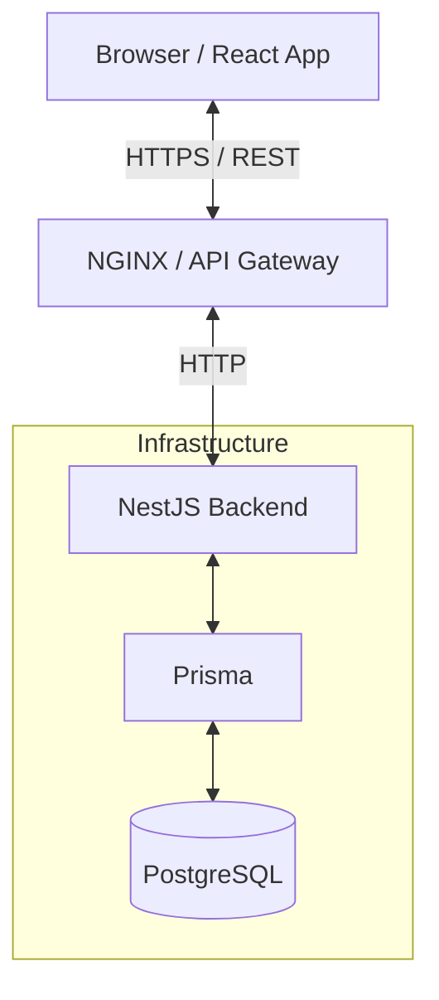

# Architecture Documentation

Nestly is architected as a modern, decoupled monolithic application. It consists of a React single-page application communicating via REST over HTTP to a NestJS backend.

## High-Level Architecture

## Frontend Architecture

The frontend is built with React 19 and Vite.

- **Routing**: `react-router` handles client-side routing, protected by route guards verifying authentication state.
- **State Management**: `Zustand` manages the global authentication state (tokens, user profile) efficiently without boilerplate.
- **API Client**: Axios is configured with request interceptors to automatically attach the JWT bearer token to outgoing requests.
- **UI Components**: Built using `shadcn/ui` and styled via Tailwind CSS v4, allowing highly customized and accessible components.

## Backend Module Architecture

The NestJS backend follows a modular domain-driven structure:

- **Auth Module**: Handles login, registration, JWT issuance, and validation.
- **Property Module**: Manages property portfolios.
- **Unit Module**: Manages individual rentable units within properties.
- **Tenant Module**: Handles tenant profile lifecycle.
- **Lease Module**: Manages the core contract state between a tenant and a unit.
- **Payment Module**: Handles rent and fee tracking.
- **Maintenance Module**: Manages issue reports and resolutions.
- **Dashboard Module**: Aggregates data for owner and tenant views.
- **Common Module**: Centralizes shared decorators (`@Roles()`), guards (`RolesGuard`, `JwtAuthGuard`), and filters.

## Authentication Flow

1. Client sends credentials to `/auth/login`.
2. Backend validates credentials against bcrypt-hashed passwords.
3. Backend issues a signed JWT containing the user ID and Role.
4. Client stores the JWT (e.g., in memory or local storage).
5. Subsequent requests include the `Authorization: Bearer <token>` header.
6. The `JwtAuthGuard` intercepts the request, verifies the token signature, and attaches the user payload to the request object.

## Authorization Flow (Multi-tenant Ownership Model)

Nestly implements a strict multi-tenant authorization layer to ensure data isolation.

- **Role-Based Access Control (RBAC)**: Endpoints are decorated with `@Roles(Role.OWNER, Role.ADMIN)`. The `RolesGuard` ensures only permitted roles can invoke the endpoint.
- **Resource Ownership**: Beyond RBAC, services verify that the requesting user actually owns the resource. For example, when fetching a unit, the service queries the database ensuring the unit belongs to a property owned by `user.id`.

## Database Interaction

Prisma is used as the ORM, abstracting raw SQL while providing type safety.
- A global `PrismaService` ensures a single connection pool is utilized across modules.
- Exceptions are caught globally by the `PrismaClientExceptionFilter`, converting database errors (e.g., unique constraint violations) into standard HTTP exception responses (e.g., 409 Conflict).

## Error Handling

Nestly utilizes a robust, centralized error handling mechanism:
- **Validation**: Incoming DTOs are validated using `class-validator`. Invalid payloads are rejected automatically with a 400 Bad Request detailing the specific validation errors.
- **Exception Filters**: Custom NestJS exception filters map domain and ORM errors to predictable, standardized JSON responses.

## Production Security

The application incorporates key production security practices:
- **Helmet**: Secures HTTP headers against common vulnerabilities (XSS, clickjacking).
- **CORS**: Strictly configured Cross-Origin Resource Sharing.
- **Rate Limiting**: `@nestjs/throttler` protects endpoints against brute-force and DoS attempts.
- **Data Sanitization**: Prisma parameterizes all queries natively to prevent SQL injection.
