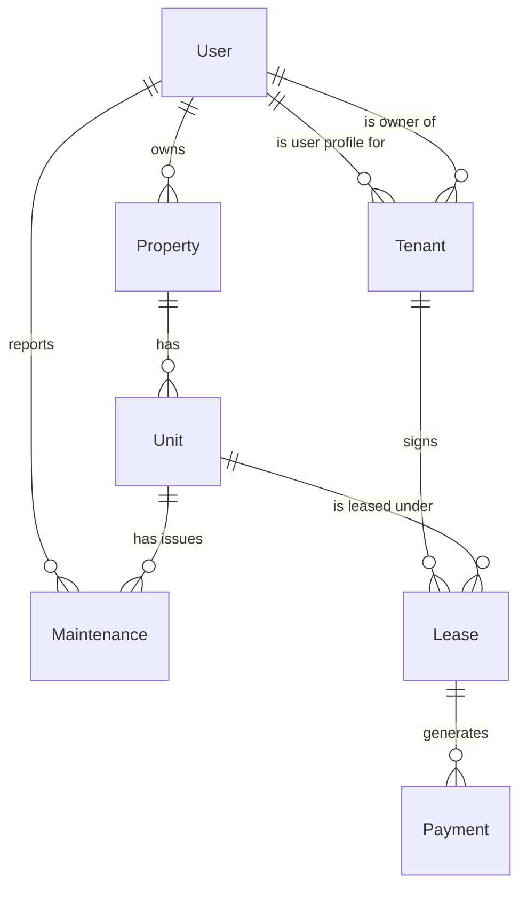

# Database Documentation

Nestly uses a strictly relational PostgreSQL database accessed via the Prisma ORM. The schema enforces data integrity through constraints and relationships, ensuring multi-tenant isolation at the data level.

## Entity Relationship Diagram

## Domain Models

### User
Represents a registered user within the system. Users can be of three roles: `ADMIN`, `OWNER`, or `TENANT`.
- An `OWNER` can have multiple `Property` entities.
- A `TENANT` user has an associated `Tenant` profile entity.
- Users report `Maintenance` requests.

### Property
A physical property (e.g., an apartment building or housing complex) owned by a specific `User` (Owner).
- **Isolation**: Belongs strictly to an `ownerId`.
- **Composition**: Contains multiple `Unit` entities.

### Unit
Individual rentable units within a `Property`.
- Tracks `status` (`VACANT`, `OCCUPIED`, `MAINTENANCE`).
- Enforces uniqueness via composite key `[propertyId, unitNo]`.

### Tenant
A domain profile representing a tenancy agreement context. It bridges the system `User` entity to the property `Owner`.
- Links a tenant `User` to an `Owner`.
- This ensures an owner can manage a tenant without modifying the global user account.

### Lease
The core contractual entity binding a `Tenant` to a `Unit` for a specific duration (`startDate`, `endDate`).
- Sets the `rentAmount`.
- Tracks the `status` (`PENDING`, `ACTIVE`, `EXPIRED`, `TERMINATED`).

### Payment
A financial transaction related to a specific `Lease`.
- Records `amount`, `method` (`CASH`, `BANK_TRANSFER`, `UPI`, `CARD`, `OTHER`), and `status` (`PENDING`, `PAID`, `FAILED`).
- Isolated through the `Lease` which belongs to a specific `Tenant` and `Unit`.

### Maintenance
An issue reported for a specific `Unit`.
- Tracks `status` (`OPEN`, `IN_PROGRESS`, `RESOLVED`, `CLOSED`).
- Tied directly to the `Unit` and the reporting `User`.

## Constraints & Referential Integrity

- The schema leverages `@relation` strict deletion policies (`onDelete: Restrict`) to prevent accidental orphaned records or cascading deletes that could compromise audit trails.
- All relationships utilize indexed foreign keys (`@@index`) for optimal query performance on multi-tenant aggregations.
